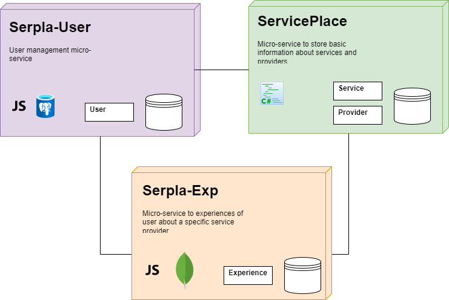

# serpla
Service Place

This a common description for the solution `serpla` (Service Place). `serpla` is used to share experience and comments about the business and services out there. A visitor may have had good experience or bad experience of a business or service they have used in the past. A denistry, a home relocation, a computer shop, a hospital, a charity and so one can be imagined as a service/business.

The architecture is micro-service based. So the whole solution is divided into micro-services. Here it is the list micro-services so far:
* [ServicePlace](https://github.com/afsharm/ServicePlace): Basic information about the services and providers (.NET/C#/SQLite)
* [serpla-user](https://github.com/afsharm/serpla-user): User management (Nest/TypeScript/PostgreSQL)
* [serpla-exp](https://github.com/afsharm/serpla-exp): User experiences (Express/JavaScript/MongoDB)
* [serpla-ui](https://github.com/afsharm/serpla-ui): ServicePlace UI (Angular)

